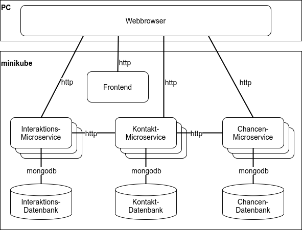

## <center>Bachelorarbeit zum Thema: </center>
# <center>Entwurf und Bereitstellung von Microservices mit Kubernetes am Beispiel eines CRM-Systems</center>
**<center>Simon Hirner</center>**
**<center>04.02.2022</center>**

---

### Zusammenfassung

Beim Entwurf von modernen Anwendungen etabliert sich zunehmend das Architekturmuster der Microservices. Microservices teilen große Anwendungen in kleine unabhängige Programme auf, welche verteilt ausgeführt werden und über feste Schnittstellen miteinander kommunizieren. Kubernetes, eine Software zur Containerorchestrierung, hilft dabei, die vielen Microservice bereitzustellen.

In der vorliegenden Bachelorarbeit wird eine moderne verteilte Webanwendung mit einer Microservice-Architektur entworfen und mithilfe von Kubernetes bereitgestellt. Dazu werden im ersten Teil der Arbeit die theoretischen Grundlagen dargelegt. Darauf aufbauend wird ein Fallbeispiel an einem vereinfachten CRM-System durchgeführt. Ziel ist es, ein Verfahren vom Entwurf bis zur Bereitstellung zu implementieren, um Aussagen zur Umsetzung und dem Anwendungsgebiet von containersisierten Microservices mit Kubernetes zu treffen.

Durch den theoretischen Hintergrund und die praktische Anwendung zeigt sich, dass Microservices hauptsächlich bei großen Systemen mit einer hohen fachlichen Breite von Vorteil sind. Vor allem die fachliche Einteilung der Microservices gestaltet sich als herausfordernd. Die vielen Entscheidungen, welche bei der Microservice-Architektur getroffen werden müssen erhöhen das Risiko für Fehler. Die höhere Flexibiltät von Microservices geht mit einer höheren Komplexität des Gesamtsystems einher. Bei der Bereitstellung kann Kubernetes mit wenig Konfigurationsaufwand viele Aufgaben wie die ServiceDiscovery, die Lastverteilung und die Skalierung übernehmen.

### Projektstruktur

```text
bachelor-thesis                    
├──contact-microservice             Kontakt-Microservice
├──interaction-microservice         Interkations-Microservice
├──opportunity-microservice         Chancen-Microservice
├──crm-frontend                     Frontend
├──kubernetes                       YAML-Dateien für Kubernetes
├──scripts                          Scripts für die Bereitstellung
└──thesis                           LaTeX-Projekt der Bachelorarbeit
```

### Verteilungsdiagramm des CRM-Systems

